<p align="center">
  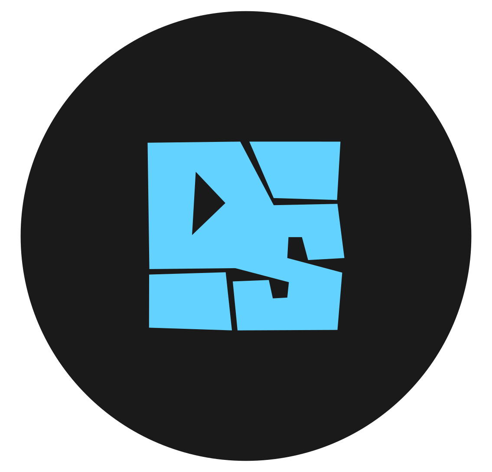
</p>

<h1 align="center">DropSauce</h1>

<p align="center">
  A lightweight, modern comic and novel reader for Android with a beautiful Material 3 Expressive design. Supports Mihon and LNReader extensions.
</p>

<p align="center">
  <a href="https://github.com/HuzaifaKhalid1311/DropSauce/releases/latest"></a>
  <a href="https://discord.com/channels/1435615296202477581/1435650246163169382/1435651186140119091"></a>
  <a href="https://github.com/HuzaifaKhalid1311/DropSauce/releases"></a>
  <a href="LICENSE"></a>
</p>

<p align="center">
  <a href="https://developer.android.com/"></a>
  <a href="https://kotlinlang.org/"></a>
  <a href="https://developer.android.com/compose"></a>
  <a href="https://m3.material.io/"></a>
</p>

<p align="center">
  <a href="https://github.com/HuzaifaKhalid1311/DropSauce/releases/latest"><strong>Download APK</strong></a>
  |
  <a href="https://drop-sauce.app"><strong>Website</strong></a>
  |
  <a href="https://discord.com/channels/1435615296202477581/1435650246163169382/1435651186140119091"><strong>Discord</strong></a>
  |
  <a href="https://github.com/HuzaifaKhalid1311/DropSauce/issues"><strong>Issues</strong></a>
</p>

---

## About this fork

### DropSauce 0.9.8 – Change Log

#### Look & feel
- **Frosted list/grid items**: new `bg_frosted_item` drawable (88% surface colour, 1dp outline, ripple) applied to `item_manga_list_details.xml` and `item_manga_grid.xml`. Light surface in light mode, dark in dark mode.
- **Frosted app bars and cards on every art theme**: added the translucent card style and themed app bar styles to the 32 theme overlays that lacked them (all Broadsheet and Brutal variants, plus the Classic variants of Terminal, Arcade, Sakura and Totoro).
- **No more solid dark band** when the app bar lifts on scroll: `liftOnScrollColor` is now the translucent `appbar_lift_translucent` (82%).
- **Settings panels frosted** (86% opacity): setting rows, theme picker, sliders, segmented options, storage card.
- **Theme picker cards**: border now drawn above the art, in the card's own colour (2.5dp selected, faint 1dp otherwise); check mark uses the same colour.
- **Theme picker split in two rows**: "Style" (theme family) on top, "Colors" for the chosen family below. Picking a family keeps your current colour when available. New strings `theme_style_label`, `theme_colors_label` (English only).

#### Performance
- **Animated background**: static art is blurred once per size change instead of every frame; animation limited to ~24 fps; paused when battery saver is on.
- **Theme switching**: bursts of changes are merged into one activity recreation (120 ms debounce).
- **Theme picker**: card art rendered once into a bitmap; colours for all themes resolved off the main thread.
- **Build types**: `debug` and `preview` are now non-debuggable and minified (R8 + resource shrinking) like `release`. Debugger/breakpoints no longer work on those builds.

#### Behaviour
- **Default list mode is now Details** (`AppSettings`, `AppearanceSettingsFragment`).
- **List mode switch flash fixed**: reveal timeout raised from 400 ms to 2 s and item animations are disabled while the mode changes, so old grid covers are never shown in the Details layout.
- **History**: finished titles (no unread chapters and progress complete) are shown in grey (title, chapter, Continue button, progress bar, cover). Details list mode only.
- **Reader**: previous/next chapter buttons turn grey when there is no chapter in that direction (`reader_toolbar_icon_tint`).


### Fork screenshots

One colour per theme (History screen):

| Material 3 | Totoro | Terminal | Broadsheet |
|---|---|---|---|
| 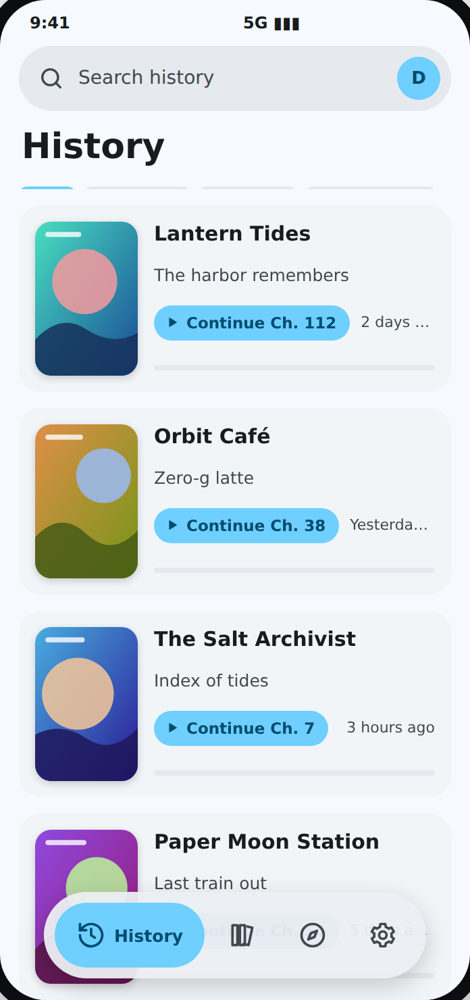 | 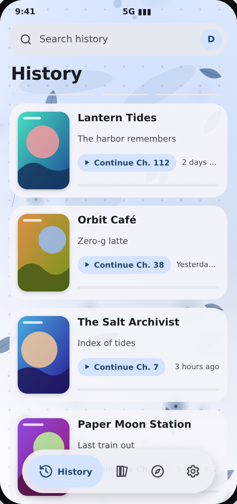 | 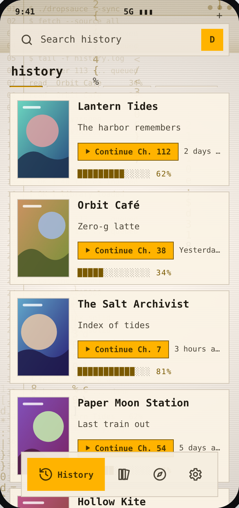 | 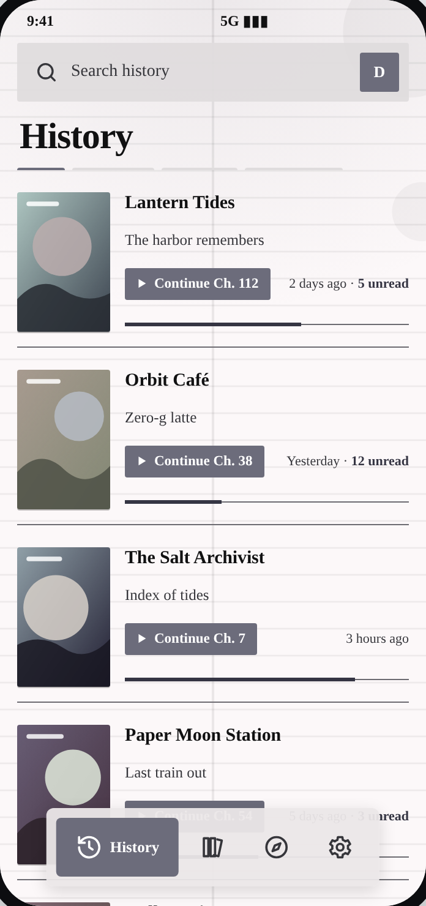 |

| Neon Arcade | Sakura Soft | Brutalist |
|---|---|---|
| 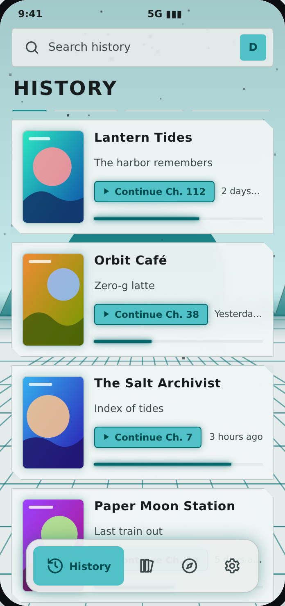 | 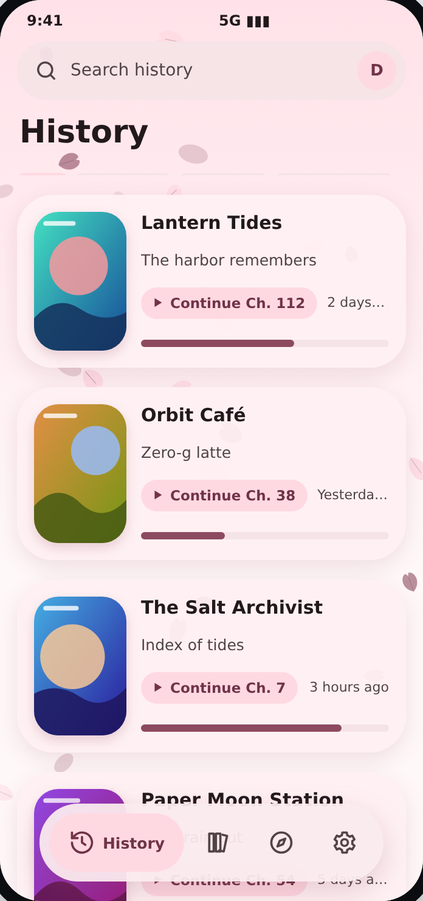 | 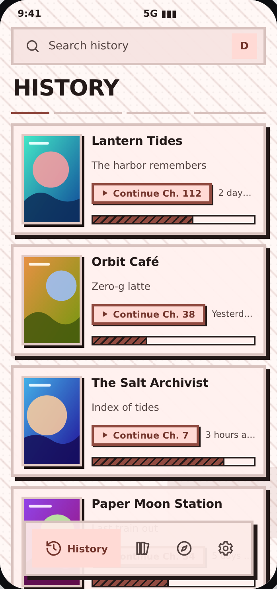 |

---

## About

DropSauce is a free and open-source comic and novel reader for Android, built to feel quick, clean, and comfortable to use with a lot of features

⭐Please give the repo a star if you like the project. It helps more people find it.🌟

## Screenshots

<p align="center">
  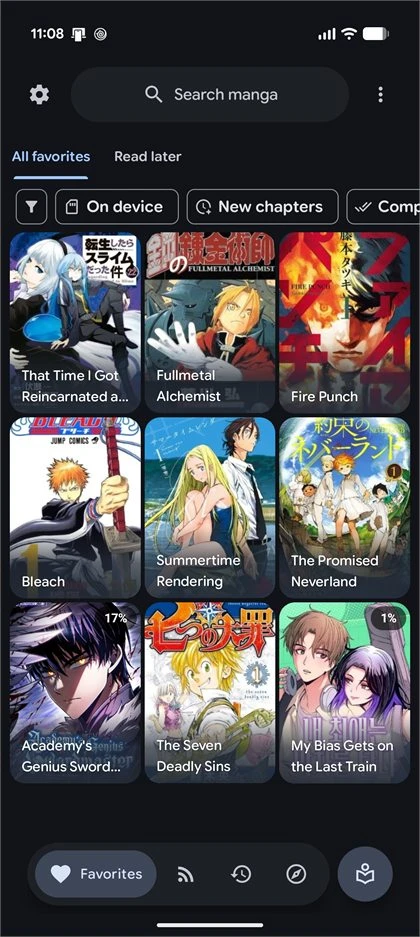
  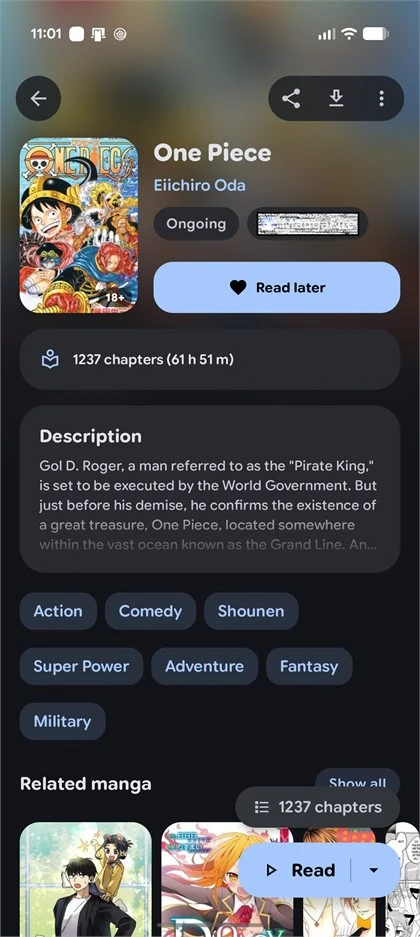
  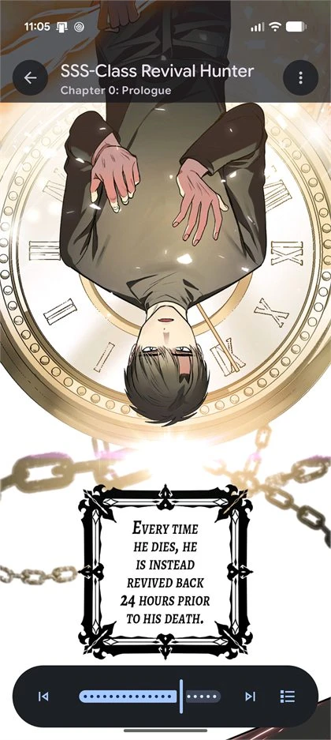
  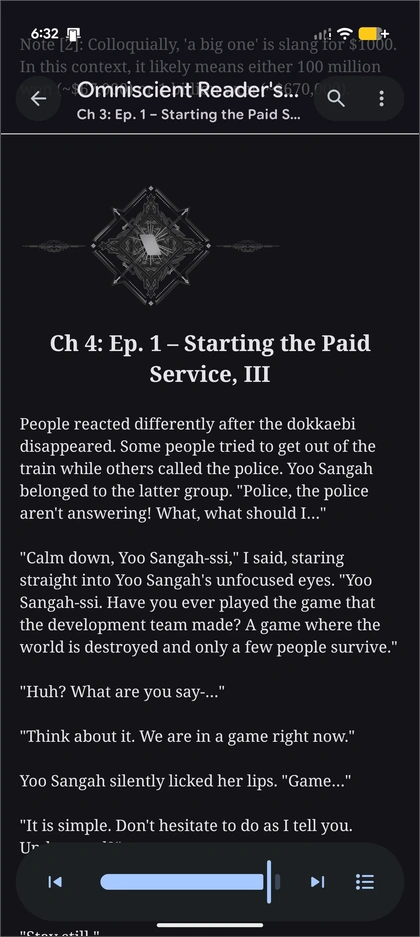
  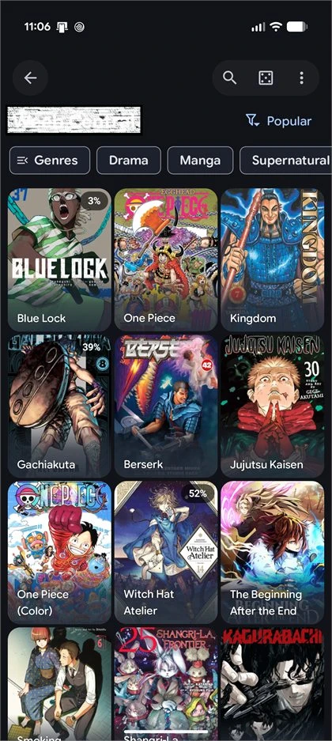
  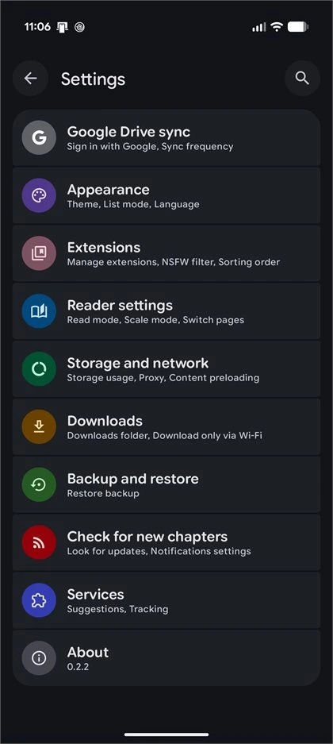
</p>

<p align="center">
  <sub>Favorites | Details | Manga/Webtoon Reader | Novel Reader | Extensions | Settings</sub>
</p>

## Highlights
- Full novel reading support alongside manga, including offline EPUB file importing.
- Multi-source extension engine supporting LNReader JS plugins and Tsundoku APK extensions.
- Lightweight Android-first experience with a modern, polished interface.
- Rich extension support with library, reading, history, bookmarks, tracking, stats, and settings tools.
- Google Drive sync, local backup/restore, and in-app updates to keep your setup moving with you.
- Supports Kotatsu and Mihon backup restoration alongside google drive sync
- Free and open-source under the GPLv3 license.

<details>
<summary><strong>Features</strong></summary>

- Comfortable manga, webtoon and novel reading experience with configurable reader behavior, haptics, and zoom gestures.
- EPUB novel importing for offline reading.
- Extensive extension ecosystem supporting native extensions, LNReader JS plugins, and Tsundoku APK extensions.
- Reverse tracking integration with a redesigned tracking menu.
- Favorites, history, bookmarks, tracking, stats, and categories to keep your library organized.
- Google Drive sync for library, history, bookmarks, tracking, stats, settings, and covers.
- Local backup and restore system for moving or protecting your setup.
- Material 3 Expressive details page for clear and quick overview
- New onboarding/welcome flow with sync and restore setup.
- Android widgets for continue reading, favorites, and reading stats.
- PDF import support, converting PDFs into readable CBZ chapters.
- App lock with biometric or device credential support.
- Downloads for offline reading when a source supports it.
- In-app updates, with APKs also published through GitHub Releases.

</details>

<details>
<summary><strong>Recent improvements</strong></summary>

- Full novel support with offline EPUB file importing.
- LNReader JS plugin and Tsundoku APK extension support.
- Interactive zoom gestures in novel reading mode.
- Added reverse tracking and refreshed tracking menu design.
- New popup animations across app flows.
- Redesigned list options, filter menu, and progress tracking.
- Minor UI improvements, edge-case crash fixes, and release build cleanups.

</details>

## Star History

<a href="https://www.star-history.com/?repos=HuzaifaKhalid1311%2FDropSauce&type=date&legend=top-left">
 <picture>
   <source media="(prefers-color-scheme: dark)" srcset="https://api.star-history.com/chart?repos=HuzaifaKhalid1311/DropSauce&type=date&theme=dark&legend=top-left&sealed_token=WCXLPn5xBgloSjmN1d0FVz4b_AhpF7pqchA72IfTFnB7loTdSNmldj4dtjRPvy25mzYWw0HbOjwW5-L3IIKZPiwQNn6MXISsmwmCuCXLybr-2c5ByQ_Ycg" />
   <source media="(prefers-color-scheme: light)" srcset="https://api.star-history.com/chart?repos=HuzaifaKhalid1311/DropSauce&type=date&legend=top-left&sealed_token=WCXLPn5xBgloSjmN1d0FVz4b_AhpF7pqchA72IfTFnB7loTdSNmldj4dtjRPvy25mzYWw0HbOjwW5-L3IIKZPiwQNn6MXISsmwmCuCXLybr-2c5ByQ_Ycg" />
   
 </picture>
</a>

## Install

1. Open the [latest GitHub release](https://github.com/HuzaifaKhalid1311/DropSauce/releases/latest).
2. Download the newest `DropSauce` APK.
3. Install it on a compatible Android device.
4. Add your preferred source or extension repository, then start reading.

Android may ask you to allow installs from your browser or file manager. That is normal for APKs downloaded outside the Play Store.

## FAQ

### Does DropSauce include manga or novels?
> No. DropSauce does not include built-in content. Sources are provided through external libraries, JS plugins, or repositories added by users.

### Is DropSauce free?
> Yes. DropSauce is free and open source under the GPLv3 license.

### How do updates work?
> DropSauce supports in-app updates, and release APKs are also published on GitHub. You can update from inside the app or install the latest APK from the Releases page.

### Can I contribute?
> Yes. Pull requests for patches, fixes, and new features are welcome.

## Project structure

```plaintext
app/src/main/
├── kotlin/org/koitharu/kotatsu/
│   ├── core/          # Shared database, network, parser, preferences, UI, and utility code
│   ├── main/          # App entry points, main activity, and app-level screens
│   ├── reader/        # Manga and novel reader UI and reading behavior
│   ├── details/       # Manga and novel details, chapters, metadata, and related services
│   ├── explore/       # Browse and discovery screens
│   ├── search/        # Search screens and search flows (with Manga/Novel toggle)
│   ├── favourites/    # Favorites and library-facing flows
│   ├── history/       # Reading history and progress
│   ├── download/      # Offline downloads and download queue
│   ├── extensions/    # Extension browsing, JS plugins, and APK extension management
│   ├── lnreader/      # LNReader JS plugin integration
│   ├── mihon/         # Mihon & Tsundoku APK extension integration
│   ├── backup/        # Local backup and restore
│   ├── sync/          # Sync data, domain, UI, and workers
│   ├── tracker/       # Tracking integrations and reverse tracking
│   ├── widget/        # Android home screen widgets
│   └── settings/      # Settings screens and preferences
└── res/
    ├── drawable*/     # Icons, backgrounds, and app artwork
    ├── layout*/       # XML screens, widgets, and reusable layouts
    ├── mipmap*/       # Launcher icons
    ├── values*/       # Strings, colors, themes, and translations
    └── xml/           # Android XML configuration
```

## Contribute

You can send a Pull Request for your patches, fixes, or new features here.

1. Fork the repository.
2. Create a focused branch for your change.
3. Build locally with `./gradlew :app:assembleDebug`.
4. Open a Pull Request with a short explanation of what changed.

Small fixes are welcome. Clear screenshots or short screen recordings are extra helpful for UI changes.

## Credits

DropSauce exists because of the work already done by the open-source Android manga reader community.

Special thanks to the original [Kotatsu](https://github.com/KotatsuApp/Kotatsu) developers, [LNReader](https://github.com/LNReader/lnreader) developers, and the [Mihon](https://github.com/mihonapp/mihon) developers/community for the ideas, code, source ecosystem, and long-running maintenance work that helped shape projects like this.

## Certificate fingerprints

<div align="left">

SHA1:

```plaintext
9A:11:C9:FC:90:C6:E4:3F:7B:D4:2B:44:A3:37:D0:85:E6:E3:27:27
```

SHA256:

```plaintext
B8:4B:C7:C7:0A:5C:B0:BF:EA:9D:EA:D9:E0:5F:00:52:CB:A1:38:4C:AE:F5:97:71:3F:27:52:E4:3F:C9:63:18
```

</div>

## License

[](http://www.gnu.org/licenses/gpl-3.0.en.html)

<div align="left">

All programs from DropSauce™ project are free, open-source programs under the GPL license. You may copy, distribute, and modify the software as long as you keep track of changes/dates in the source files. Any modifications to the software, including code licensed under the GPL (via a compiler), must also be provided under the GPL license.

</div>

## Disclaimer

<div align="left">

The developer(s) of this application do not have any affiliation with the content providers available. If there is any content, it is provided by external libraries added or imported by users; the application itself does not include any built-in content.

</div>
